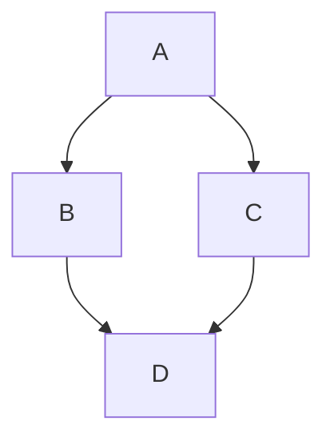

Collection of Markdown examples.

# Heading 1

Lorem ipsum is placeholder text commonly used in the graphic, print, and publishing industries for previewing layouts and visual mockups. Lorem ipsum is placeholder text commonly used in the graphic, print, and publishing industries for previewing layouts and visual mockups. Lorem ipsum is placeholder text commonly used in the graphic, print, and publishing industries for previewing layouts and visual mockups. Lorem ipsum is placeholder text commonly used in the graphic, print, and publishing industries for previewing layouts and visual mockups.

Lorem ipsum is placeholder text commonly used in the graphic, print, and publishing industries for previewing layouts and visual mockups. Lorem ipsum is placeholder text commonly used in the graphic, print, and publishing industries for previewing layouts and visual mockups. Lorem ipsum is placeholder text commonly used in the graphic, print, and publishing industries for previewing layouts and visual mockups. Lorem ipsum is placeholder text commonly used in the graphic, print, and publishing industries for previewing layouts and visual mockups.

## Heading 2
Text. Text. Text. Text. Text. Text. Text. Text. Text. Text.
Text. Text. Text. Text. Text. Text. Text. Text. Text. Text.
Text. Text. Text. Text. Text. Text. Text. Text. Text. Text.

### Heading 3
Text. Text. Text. Text. Text. Text. Text. Text. Text. Text.
Text. Text. Text. Text. Text. Text. Text. Text. Text. Text.
Text. Text. Text. Text. Text. Text. Text. Text. Text. Text.

#### Heading 4
Text. Text. Text. Text. Text. Text. Text. Text. Text. Text.
Text. Text. Text. Text. Text. Text. Text. Text. Text. Text.
Text. Text. Text. Text. Text. Text. Text. Text. Text. Text.

##### Heading 5
Text. Text. Text. Text. Text. Text. Text. Text. Text. Text.
Text. Text. Text. Text. Text. Text. Text. Text. Text. Text.
Text. Text. Text. Text. Text. Text. Text. Text. Text. Text.

###### Heading 6
Text. Text. Text. Text. Text. Text. Text. Text. Text. Text.
Text. Text. Text. Text. Text. Text. Text. Text. Text. Text.
Text. Text. Text. Text. Text. Text. Text. Text. Text. Text.

####### Heading 7
Text. Text. Text. Text. Text. Text. Text. Text. Text. Text.
Text. Text. Text. Text. Text. Text. Text. Text. Text. Text.
Text. Text. Text. Text. Text. Text. Text. Text. Text. Text.

# Links

### Text link

- [Link to external website](www.google.com)
- [Link to heading](#heading-1)

### Pill image link

[](https://discord.gg/aaaaaaaaaaaa)

**Boost your development and feel free to use your imagination!**

# Adding `newline` to sentence

### You can use `double space`
This is the first line.  
This is the second line.  

### Or you can use backslack `\`
This is the first line.\
This is the second line.\

### Or you can use the HTML `<br>` tag
This is the first line.<br>
This is the second line.<br>


# Highligth

### Single word highlight

The following `word` is a single line code.

### Block highligth

```js
// This is a javascript code block.
const a = 10;
let b = 0x10;
var c = "30";
```

```c
// This is a C code block.
const int width = 800;
void getWidth()
{
  return width;
}
```

# Bullet list

- Bullet item 1
- Bullet list 2
  - Nested bullet item
    - List 3
   
# Checkbox

- [ ] Item A
- [x] Item B
- [x] Item C
- [ ] #739
- [ ] https://github.com/rieowpirpoweipro
- [ ] Tada emoji :tada:

# Tables

## Markdown tables

### Example 1

| First Header  | Second Header |
| ------------- | ------------- |
| Content Cell  | Content Cell  |
| Content Cell  | Content Cell  |

### Example 2

| Command | Description |
| --- | --- |
| `git status` | List all *new or modified* files |
| `git diff` | Show file differences that **haven't been** staged |

### Example 3

| Name     | Character |
| ---      | ---       |
| Backtick | `         |
| Pipe     | \|        |

## HTML tables

<table>
  <tr>
    <th>col 1</th>
    <th>col 2</th>
    <th>col 3</th>
  </tr>
  <tr>
    <td>row 1 - col 1</td>
    <td>row 1 - col 2</td>
    <td>row 1 - col 3</td>
  </tr>
</table>

## rowspan

<table>
  <tr>
    <th>column 1</th>
    <th>column 2</th>
    <th>column 3</th>
  </tr>
  <tr>
    <td>row 1 - column 1</td>
    <td>row 1 - column 2</td>
    <td rowspan="2" align="center">row 1 & 2 - column 3</td>
  </tr>
  <tr>
    <td>row 2 - column 1</td>
    <td>row 2 - column 2</td>
  </tr>
</table>

## colspan

<table>
  <tr>
    <th>column 1</th>
    <th>column 2</th>
    <th>column 3</th>
  </tr>
  <tr>
    <td>row 1 - column 1</td>
    <td colspan="2" align="center">row 1 - column 2 & 3</td>
  </tr>
  <tr>
    <td>row 2 - column 1</td>
    <td>row 2 - column 2</td>
    <td>row 2 - column 3</td>
  </tr>
</table>

# Images/Pictures/Video

### Image from web

``


### Image hosted in this repository
``


# File render

### STL file render

```stl
solid cube_corner
  facet normal 0.0 -1.0 0.0
    outer loop
      vertex 0.0 0.0 0.0
      vertex 1.0 0.0 0.0
      vertex 0.0 0.0 1.0
    endloop
  endfacet
  facet normal 0.0 0.0 -1.0
    outer loop
      vertex 0.0 0.0 0.0
      vertex 0.0 1.0 0.0
      vertex 1.0 0.0 0.0
    endloop
  endfacet
  facet normal -1.0 0.0 0.0
    outer loop
      vertex 0.0 0.0 0.0
      vertex 0.0 0.0 1.0
      vertex 0.0 1.0 0.0
    endloop
  endfacet
  facet normal 0.577 0.577 0.577
    outer loop
      vertex 1.0 0.0 0.0
      vertex 0.0 1.0 0.0
      vertex 0.0 0.0 1.0
    endloop
  endfacet
endsolid
```
### HTML render

<div align="center">
  <a href="www.google.com" target="_blank">
    
  </a>
</div>  


### Mermaid diagram render




