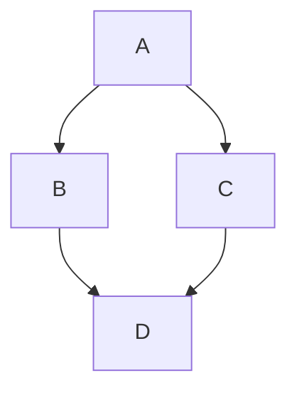

# Heading 1
Text.

## Heading 2
Text.

### Heading 3
Text.

#### Heading 4
Text.

# New lines

### You can use double space
This is the first line.  
This is the second line.  

### Or you can use backslack `\`
This is the first line.\
This is the second line.\

### Or you can use the HTML `<br>` tag.  
This is the first line.<br>
This is the second line.<br>

# Code blocks

```
This is a code block.
int a = 10;
int b = 20;
```

# Word code

The following `word` is a single line code.

# Tables

## Markdown tables

### Example 1

| First Header  | Second Header |
| ------------- | ------------- |
| Content Cell  | Content Cell  |
| Content Cell  | Content Cell  |

### Example 2

| Command | Description |
| --- | --- |
| `git status` | List all *new or modified* files |
| `git diff` | Show file differences that **haven't been** staged |

### Example 3

| Name     | Character |
| ---      | ---       |
| Backtick | `         |
| Pipe     | \|        |

## HTML tables

<table>
  <tr>
    <th>col 1</th>
    <th>col 2</th>
    <th>col 3</th>
  </tr>
  <tr>
    <td>row 1 - col 1</td>
    <td>row 1 - col 2</td>
    <td>row 1 - col 3</td>
  </tr>
</table>

## rowspan

<table>
  <tr>
    <th>column 1</th>
    <th>column 2</th>
    <th>column 3</th>
  </tr>
  <tr>
    <td>row 1 - column 1</td>
    <td>row 1 - column 2</td>
    <td rowspan="2" align="center">row 1 & 2 - column 3</td>
  </tr>
  <tr>
    <td>row 2 - column 1</td>
    <td>row 2 - column 2</td>
  </tr>
</table>

## colspan

<table>
  <tr>
    <th>column 1</th>
    <th>column 2</th>
    <th>column 3</th>
  </tr>
  <tr>
    <td>row 1 - column 1</td>
    <td colspan="2" align="center">row 1 - column 2 & 3</td>
  </tr>
  <tr>
    <td>row 2 - column 1</td>
    <td>row 2 - column 2</td>
    <td>row 2 - column 3</td>
  </tr>
</table>

# Task list

- [x] #739
- [ ] https://github.com/octo-org/octo-repo/issues/740
- [ ] Add delight to the experience when all tasks are complete :tada:

# Mermaid diagram



# Images


``


``


``

# Random

- [Getting started with Markdown](#getting-started-with-markdown)
- [Titles](#titles)

Aaaaa

=============

AAAAAA

- [ ] Item A
- [x] Item B
- [x] Item C

=============

[](https://discord.gg/aaaaaaaaaaaa)

**Boost your development and feel free to use your imagination!**

If you want to keep up to date with the latest PixiJS news then feel free to follow us on Twitter [@PixiJS](https://twitter.com/PixiJS)
and we will keep you posted! You can also check back on [our site](https://www.pixijs.com)
as any breakthroughs will be posted up there too!
  
<div align="center">
  <a href="https://opencollective.com/pixijs/donate" target="_blank">
    
  </a>
</div>  

Lorem ipsum is placeholder text commonly used in the graphic, print, and publishing industries for previewing layouts and visual mockups. Lorem ipsum is placeholder text commonly used in the graphic, print, and publishing industries for previewing layouts and visual mockups. Lorem ipsum is placeholder text commonly used in the graphic, print, and publishing industries for previewing layouts and visual mockups. Lorem ipsum is placeholder text commonly used in the graphic, print, and publishing industries for previewing layouts and visual mockups.

#### NPM Install

```sh
npm install pixi.js
```

There is no default export. The correct way to import PixiJS is:

```js
import * as PIXI from 'pixi.js';
```

# Heading 1

Lorem ipsum is placeholder text commonly used in the graphic, print, and publishing industries for previewing layouts and visual mockups. Lorem ipsum is placeholder text commonly used in the graphic, print, and publishing industries for previewing layouts and visual mockups. Lorem ipsum is placeholder text commonly used in the graphic, print, and publishing industries for previewing layouts and visual mockups. Lorem ipsum is placeholder text commonly used in the graphic, print, and publishing industries for previewing layouts and visual mockups.

  Lorem ipsum is placeholder text commonly.

Lorem ipsum is placeholder text commonly.

## Heading 2

Lorem ipsum is placeholder text commonly used in the graphic, print, and publishing industries for previewing layouts and visual mockups. Lorem ipsum is placeholder text commonly used in the graphic, print, and publishing industries for previewing layouts and visual mockups. Lorem ipsum is placeholder text commonly used in the graphic, print, and publishing industries for previewing layouts and visual mockups. Lorem ipsum is placeholder text commonly used in the graphic, print, and publishing industries for previewing layouts and visual mockups.

### Heading 3

Lorem ipsum is placeholder text commonly used in the graphic, print, and publishing industries for previewing layouts and visual mockups. Lorem ipsum is placeholder text commonly used in the graphic, print, and publishing industries for previewing layouts and visual mockups. Lorem ipsum is placeholder text commonly used in the graphic, print, and publishing industries for previewing layouts and visual mockups. Lorem ipsum is placeholder text commonly used in the graphic, print, and publishing industries for previewing layouts and visual mockups.

#### Heading 4

Lorem ipsum is placeholder text commonly used in the graphic, print, and publishing industries for previewing layouts and visual mockups. Lorem ipsum is placeholder text commonly used in the graphic, print, and publishing industries for previewing layouts and visual mockups. Lorem ipsum is placeholder text commonly used in the graphic, print, and publishing industries for previewing layouts and visual mockups. Lorem ipsum is placeholder text commonly used in the graphic, print, and publishing industries for previewing layouts and visual mockups.

- Bullet list 1
  - List 2
    - List 3
