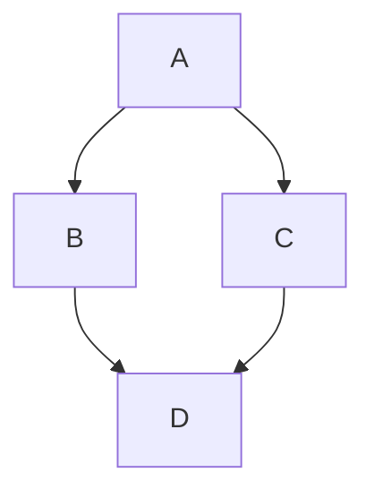

Collection of Markdown examples.

# Index
 
# Heading 1

Lorem ipsum dolor sit amet, consectetur adipiscing elit, sed do eiusmod tempor incididunt ut labore et dolore magna aliqua. Ut enim ad minim veniam, quis nostrud exercitation ullamco laboris nisi ut aliquip ex ea commodo consequat. Duis aute irure dolor in reprehenderit in voluptate velit esse cillum dolore eu fugiat nulla pariatur. Excepteur sint occaecat cupidatat non proident, sunt in culpa qui officia deserunt mollit anim id est laborum.

Lorem ipsum dolor sit amet, consectetur adipiscing elit, sed do eiusmod tempor incididunt ut labore et dolore magna aliqua. Ut enim ad minim veniam, quis nostrud exercitation ullamco laboris nisi ut aliquip ex ea commodo consequat. Duis aute irure dolor in reprehenderit in voluptate velit esse cillum dolore eu fugiat nulla pariatur. Excepteur sint occaecat cupidatat non proident, sunt in culpa qui officia deserunt mollit anim id est laborum.

## Heading 2

Lorem ipsum dolor sit amet, consectetur adipiscing elit, sed do eiusmod tempor incididunt ut labore et dolore magna aliqua. Ut enim ad minim veniam, quis nostrud exercitation ullamco laboris nisi ut aliquip ex ea commodo consequat. Duis aute irure dolor in reprehenderit in voluptate velit esse cillum dolore eu fugiat nulla pariatur. Excepteur sint occaecat cupidatat non proident, sunt in culpa qui officia deserunt mollit anim id est laborum.

Lorem ipsum dolor sit amet, consectetur adipiscing elit, sed do eiusmod tempor incididunt ut labore et dolore magna aliqua. Ut enim ad minim veniam, quis nostrud exercitation ullamco laboris nisi ut aliquip ex ea commodo consequat. Duis aute irure dolor in reprehenderit in voluptate velit esse cillum dolore eu fugiat nulla pariatur. Excepteur sint occaecat cupidatat non proident, sunt in culpa qui officia deserunt mollit anim id est laborum.

### Heading 3

Lorem ipsum dolor sit amet, consectetur adipiscing elit, sed do eiusmod tempor incididunt ut labore et dolore magna aliqua. Ut enim ad minim veniam, quis nostrud exercitation ullamco laboris nisi ut aliquip ex ea commodo consequat. Duis aute irure dolor in reprehenderit in voluptate velit esse cillum dolore eu fugiat nulla pariatur. Excepteur sint occaecat cupidatat non proident, sunt in culpa qui officia deserunt mollit anim id est laborum.

Lorem ipsum dolor sit amet, consectetur adipiscing elit, sed do eiusmod tempor incididunt ut labore et dolore magna aliqua. Ut enim ad minim veniam, quis nostrud exercitation ullamco laboris nisi ut aliquip ex ea commodo consequat. Duis aute irure dolor in reprehenderit in voluptate velit esse cillum dolore eu fugiat nulla pariatur. Excepteur sint occaecat cupidatat non proident, sunt in culpa qui officia deserunt mollit anim id est laborum.

#### Heading 4

Lorem ipsum dolor sit amet, consectetur adipiscing elit, sed do eiusmod tempor incididunt ut labore et dolore magna aliqua. Ut enim ad minim veniam, quis nostrud exercitation ullamco laboris nisi ut aliquip ex ea commodo consequat. Duis aute irure dolor in reprehenderit in voluptate velit esse cillum dolore eu fugiat nulla pariatur. Excepteur sint occaecat cupidatat non proident, sunt in culpa qui officia deserunt mollit anim id est laborum.

##### Heading 5

Lorem ipsum dolor sit amet, consectetur adipiscing elit, sed do eiusmod tempor incididunt ut labore et dolore magna aliqua. Ut enim ad minim veniam, quis nostrud exercitation ullamco laboris nisi ut aliquip ex ea commodo consequat. Duis aute irure dolor in reprehenderit in voluptate velit esse cillum dolore eu fugiat nulla pariatur. Excepteur sint occaecat cupidatat non proident, sunt in culpa qui officia deserunt mollit anim id est laborum.

###### Heading 6

Lorem ipsum dolor sit amet, consectetur adipiscing elit, sed do eiusmod tempor incididunt ut labore et dolore magna aliqua. Ut enim ad minim veniam, quis nostrud exercitation ullamco laboris nisi ut aliquip ex ea commodo consequat. Duis aute irure dolor in reprehenderit in voluptate velit esse cillum dolore eu fugiat nulla pariatur. Excepteur sint occaecat cupidatat non proident, sunt in culpa qui officia deserunt mollit anim id est laborum.

# Links

### Text link

- [Link to external website](www.google.com)
- [Link to heading](#heading-1)

### Pill image link

[](https://discord.gg/aaaaaaaaaaaa)

**Boost your development and feel free to use your imagination!**

# Adding `newline` to sentence

### You can use `double space`
This is the first line.  
This is the second line.  

### Or you can use backslack `\`
This is the first line.\
This is the second line.\

### Or you can use the HTML `<br>` tag
This is the first line.<br>
This is the second line.<br>


# Highligth

### Single word highlight

The following `word` is a single line code.

### Block highligth

```js
// This is a javascript code block.
const a = 10;
let b = 0x10;
var c = "30";
```

```c
// This is a C code block.
const int width = 800;
void getWidth()
{
  return width;
}
```

# Bullet list

- Bullet item 1
- Bullet list 2
  - Nested bullet item
    - List 3
   
# Checkbox

- [ ] Item A
- [x] Item B
- [x] Item C
- [ ] #739
- [ ] https://github.com/rieowpirpoweipro
- [ ] Tada emoji :tada:

# Markdown table

### Example 1

| First Header  | Second Header |
| ------------- | ------------- |
| Content Cell  | Content Cell  |
| Content Cell  | Content Cell  |

```
| First Header  | Second Header |
| ------------- | ------------- |
| Content Cell  | Content Cell  |
| Content Cell  | Content Cell  |
```

### Example 2

| Command | Description |
| --- | --- |
| `git status` | List all *new or modified* files |
| `git diff` | Show file differences that **haven't been** staged |

```
| Command | Description |
| --- | --- |
| `git status` | List all *new or modified* files |
| `git diff` | Show file differences that **haven't been** staged |
```

### Example 3

| Name     | Character |
| ---      | ---       |
| Backtick | `         |
| Pipe     | \|        |

```
| Name     | Character |
| ---      | ---       |
| Backtick | `         |
| Pipe     | \|        |
```

# HTML table

### Classic

<table>
  <tr>
    <th>col 1</th>
    <th>col 2</th>
    <th>col 3</th>
  </tr>
  <tr>
    <td>row 1 - col 1</td>
    <td>row 1 - col 2</td>
    <td>row 1 - col 3</td>
  </tr>
</table>

```html
<table>
  <tr>
    <th>col 1</th>
    <th>col 2</th>
    <th>col 3</th>
  </tr>
  <tr>
    <td>row 1 - col 1</td>
    <td>row 1 - col 2</td>
    <td>row 1 - col 3</td>
  </tr>
</table>
```

### rowspan

<table>
  <tr>
    <th>column 1</th>
    <th>column 2</th>
    <th>column 3</th>
  </tr>
  <tr>
    <td>row 1 - column 1</td>
    <td>row 1 - column 2</td>
    <td rowspan="2" align="center">row 1 & 2 - column 3</td>
  </tr>
  <tr>
    <td>row 2 - column 1</td>
    <td>row 2 - column 2</td>
  </tr>
</table>

### colspan

<table>
  <tr>
    <th>column 1</th>
    <th>column 2</th>
    <th>column 3</th>
  </tr>
  <tr>
    <td>row 1 - column 1</td>
    <td colspan="2" align="center">row 1 - column 2 & 3</td>
  </tr>
  <tr>
    <td>row 2 - column 1</td>
    <td>row 2 - column 2</td>
    <td>row 2 - column 3</td>
  </tr>
</table>

# Images/Pictures/Video

### HTML JPEG image from URL


### HTML SVG image hosted in this repo


### Markdown JPEG imagem from URL
 
``

### Markdown SVG imagem from URL


# HTML render

<div align="center">
  <a href="www.google.com" target="_blank">
    <h1>This is H1 inside link</h1>
  </a>
</div>

# Render

### Inline SVG

```svg
<svg height="32" viewBox="0 0 16 16" version="1.1" width="32" data-view-component="true">
  <path d="M8 0c4.42 0 8 3.58 8 8a8.013 8.013 0 0 1-5.45 7.59c-.4.08-.55-.17-.55-.38 0-.27.01-1.13.01-2.2 0-.75-.25-1.23-.54-1.48 1.78-.2 3.65-.88 3.65-3.95 0-.88-.31-1.59-.82-2.15.08-.2.36-1.02-.08-2.12 0 0-.67-.22-2.2.82-.64-.18-1.32-.27-2-.27-.68 0-1.36.09-2 .27-1.53-1.03-2.2-.82-2.2-.82-.44 1.1-.16 1.92-.08 2.12-.51.56-.82 1.28-.82 2.15 0 3.06 1.86 3.75 3.64 3.95-.23.2-.44.55-.51 1.07-.46.21-1.61.55-2.33-.66-.15-.24-.6-.83-1.23-.82-.67.01-.27.38.01.53.34.19.73.9.82 1.13.16.45.68 1.31 2.69.94 0 .67.01 1.3.01 1.49 0 .21-.15.45-.55.38A7.995 7.995 0 0 1 0 8c0-4.42 3.58-8 8-8Z"></path>
</svg>
```

```svg
<svg height="32" viewBox="0 0 16 16" version="1.1" width="32" data-view-component="true">
M8 0c4.42 0 8 3.58 8 8a8.013 8.013 0 0 1-5.45 7.59c-.4.08-.55-.17-.55-.38 0-.27.01-1.13.01-2.2 0-.75-.25-1.23-.54-1.48 1.78-.2 3.65-.88 3.65-3.95 0-.88-.31-1.59-.82-2.15.08-.2.36-1.02-.08-2.12 0 0-.67-.22-2.2.82-.64-.18-1.32-.27-2-.27-.68 0-1.36.09-2 .27-1.53-1.03-2.2-.82-2.2-.82-.44 1.1-.16 1.92-.08 2.12-.51.56-.82 1.28-.82 2.15 0 3.06 1.86 3.75 3.64 3.95-.23.2-.44.55-.51 1.07-.46.21-1.61.55-2.33-.66-.15-.24-.6-.83-1.23-.82-.67.01-.27.38.01.53.34.19.73.9.82 1.13.16.45.68 1.31 2.69.94 0 .67.01 1.3.01 1.49 0 .21-.15.45-.55.38A7.995 7.995 0 0 1 0 8c0-4.42 3.58-8 8-8Z"
```

### Inline STL model render

```stl
solid cube_corner
  facet normal 0.0 -1.0 0.0
    outer loop
      vertex 0.0 0.0 0.0
      vertex 1.0 0.0 0.0
      vertex 0.0 0.0 1.0
    endloop
  endfacet
  facet normal 0.0 0.0 -1.0
    outer loop
      vertex 0.0 0.0 0.0
      vertex 0.0 1.0 0.0
      vertex 1.0 0.0 0.0
    endloop
  endfacet
  facet normal -1.0 0.0 0.0
    outer loop
      vertex 0.0 0.0 0.0
      vertex 0.0 0.0 1.0
      vertex 0.0 1.0 0.0
    endloop
  endfacet
  facet normal 0.577 0.577 0.577
    outer loop
      vertex 1.0 0.0 0.0
      vertex 0.0 1.0 0.0
      vertex 0.0 0.0 1.0
    endloop
  endfacet
endsolid
```

### Inline Mermaid diagram render




